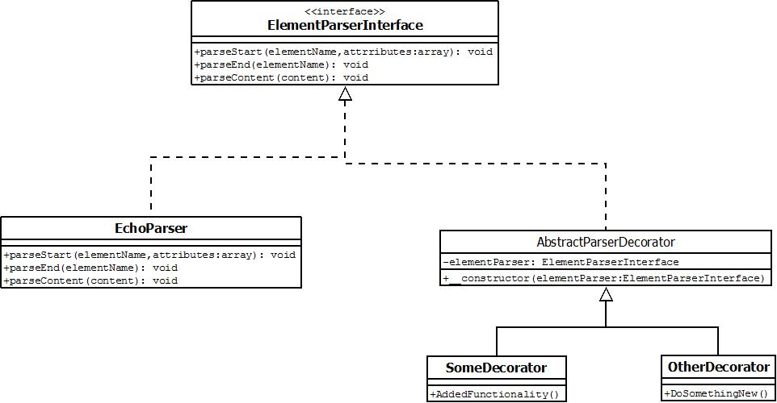

# Opgave Webs4 - XML
##Door
* Yorick van Klinken
* Patrick Berenschot

## Deelopdracht 1
Voor deze opdracht is er een generieke parser geschreven. Hierdoor maakt het niet uit of er SAX of DOM gebruikt wordt. Dit is gedaan op een proof-of-concept manier. De functionaliteit is gelijk aan die van aan simpele SAX parsers. Het maakt hierbij niet uit of je als basis DOM of SAX gebruikt. uiteraard is het wel zo dat het alleen een parser is zodra je DOM gebruik je nog steeds geen elementen kan aanpassen.

Er is dus een interface welke tweemaal gerealiseerd wordt. Eenmaal op SAX basis en eenmaal op DOM basis. Door deze interface te introduceren wordt het verschil tussen SAX en DOm parsen weg gehaald. Het resultaat is dus identiek, ongeacht welke parsers gebruikt wordt.

Er is gekozen voor deze structuur zodat je makkelijk elementen kan parsen met een element parser. Doordat een element parsen nu niet hoeft te weten door welke parser hij gebruikt wordt is het maken van een parser vele malen simpeler. Een element parser hoeft alleen de volgende methodes te implementeren, `parseStart`, `parseEnd` en `parseContent`. `parseStart` wordt aangeroepen zodra er een open tag wordt gevonden door een parser. `parseContent` wordt aangeroepen zodra er text tussen twee tags staan, hierbij wordt whitespace genegeerd. Vervolgens wordt `parseEnd` aangeroepen zodra een sluit tag gevonden is.

In de uitwerking wordt de structuur van een willekeurig XML bestand getoont. Ter voorbeeld is AII.xml ingesteld als XML document. Als output wordt twee maal de volledige structuur getoont. Deze is identiek te zijn ondanks dat het de eerste keer met SAX en de tweede keer met een DOM parser is verwerkt.

## Deelopdracht 2
In deze opdracht wordt de 5 daagse vooruitzicht verwerkt uit het `buienradar.xml` bestand. Deze wordt zo geparsed dat de inhoud netjes in een HTML tabel wordt getoont. Er is hier gekozen voor het _Decorator Pattern_. Hierdoor is het mogelijk om in runtime de functionaliteit van een element parser uit te breiden. 
